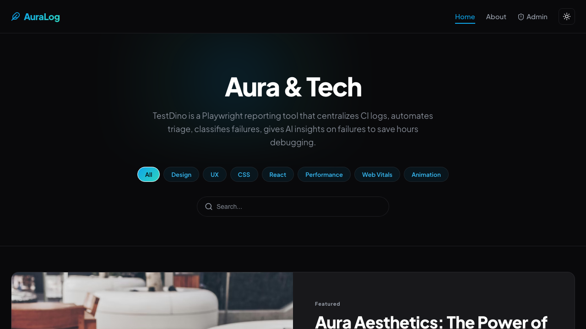

# Jason's Diary

A modern personal blog built with React and Vite. It includes a public reading experience (homepage, articles, about page), an admin CMS for writing and publishing posts, bilingual UI (English / Vietnamese), and optional Supabase backend integration.

**Live demo:** [blog-web-application-gamma.vercel.app](https://blog-web-application-gamma.vercel.app)



---

## Features

### Public site
- **Homepage** with hero search, category filters, featured article, latest posts, and a “more articles” grid
- **Article pages** with Markdown rendering, table of contents, and optimized cover images
- **About page** with author profile and skills
- **Light / dark theme** and **EN / VI** language switcher
- **Responsive layout** inspired by premium editorial blogs (e.g. testdino.com/blog)

### Admin CMS
- Dashboard to list, filter, edit, and delete posts (draft / published)
- Rich **post editor** with live Markdown preview
- **Auto-generated cover images** — mesh gradient background + title when no cover URL is provided
- **Reusable post tags** — search existing tags or create new ones; stored in Supabase (`post_tags`) or localStorage in mock mode
- Auto-slug generation from title

### Developer experience
- TypeScript + ESLint
- Playwright E2E tests (visitor, admin, create-post flows)
- Lazy-loaded routes for smaller initial bundle
- Mock mode for local development without Supabase

---

## Tech stack

| Layer | Technology |
|-------|------------|
| UI | React 19, React Router 7 |
| Build | Vite 8, TypeScript |
| Styling | CSS (custom design tokens) |
| Content | Markdown (`react-markdown`) |
| i18n | i18next / react-i18next |
| Backend (optional) | Supabase (Auth, Postgres, Storage) |
| Testing | Playwright |
| Deploy | Vercel |

---

## Quick start

### Prerequisites
- Node.js 20+
- npm

### Install & run

```bash
git clone https://github.com/imminh20x/jasonsdiary.git
cd jasonsdiary
npm install
npm run dev
```

Open [http://localhost:5173](http://localhost:5173).

### Build for production

```bash
npm run build
npm run preview
```

---

## Mock mode vs Supabase

The app detects whether Supabase is configured via environment variables.

| Mode | When | Data storage |
|------|------|--------------|
| **Mock** | `.env` missing or still has placeholder values | `localStorage` (`mockDb`) |
| **Supabase** | Valid `VITE_SUPABASE_URL` + `VITE_SUPABASE_ANON_KEY` | Supabase Postgres + Storage |

Copy the example env file:

```bash
cp .env.example .env
```

### Admin login (mock mode, development only)

When Supabase is not configured **and** you run `npm run dev`:

| Email | Password |
|-------|----------|
| `admin@blog.com` | `password` |
| `admin@example.com` | `admin` |

Mock admin auth is **disabled in production builds** for security.

Admin routes: `/login` → `/admin` → `/admin/new`

---

## Supabase setup

1. Create a project at [supabase.com](https://supabase.com)
2. Run SQL in the dashboard (**SQL Editor**):
   - `supabase/schema.sql` — `posts`, `post_tags`, RLS policies
   - `supabase/storage.sql` — `blog-images` bucket
3. Create an admin user: **Authentication → Users → Add user**
4. Fill in `.env`:

```env
VITE_SUPABASE_URL=https://your-project-id.supabase.co
VITE_SUPABASE_ANON_KEY=your-anon-public-api-key
```

5. Verify connection:

```bash
npm run check:supabase
```

6. Restart the dev server: `npm run dev`

---

## Project structure

```
├── src/
│   ├── components/       # Header, Footer, PostTagsInput, …
│   ├── pages/              # BlogHome, BlogPost, AdminEditor, …
│   ├── context/            # AuthContext
│   ├── services/           # Supabase data layer (db.ts)
│   ├── utils/              # mockDb, cover generator, post tags, …
│   ├── i18n/               # en.json, vi.json
│   └── constants/          # Site author info
├── supabase/               # schema.sql, storage.sql
├── tests/                  # Playwright E2E specs + page objects
├── scripts/                # check-supabase.mjs
└── public/                 # Static assets
```

---

## npm scripts

| Command | Description |
|---------|-------------|
| `npm run dev` | Start dev server (port 5173) |
| `npm run build` | Type-check + production build |
| `npm run preview` | Preview production build locally |
| `npm run lint` | Run ESLint |
| `npm run check:supabase` | Test Supabase URL, tables, storage bucket |

### E2E tests

Playwright starts the dev server automatically:

```bash
npx playwright test
npx playwright test --ui          # interactive mode
npx playwright show-report        # open HTML report
```

Test suites:
- `tests/visitor.spec.ts` — homepage, search, navigation
- `tests/admin.spec.ts` — login, CRUD
- `tests/create-post.spec.ts` — editor, slug, preview, publish
- `tests/about.spec.ts` — about page

---

## Deployment (Vercel)

1. Push to GitHub
2. Import the repo in [Vercel](https://vercel.com)
3. Add environment variables (`VITE_SUPABASE_URL`, `VITE_SUPABASE_ANON_KEY`) if using Supabase
4. Deploy — `vercel.json` handles SPA routing

Without Supabase env vars on Vercel, the production site runs in mock mode (localStorage per browser — not suitable for a real multi-user CMS).

---

## Cover image generation

If a post has no cover URL, the app generates an SVG cover with:
- Soft **mesh gradient** background (deterministic colors from title)
- Centered **title box** with rounded corners matching article cards

Implementation: `src/utils/generateCoverImage.ts`

---

## Git ignore notes

Local dev artifacts are ignored and should not be committed:

- `.playwright-mcp/` — Playwright MCP debug snapshots
- `playwright-report/`, `test-results/`
- `layout-*.png`, `compare-*.png` — layout comparison screenshots

---

## Author

**Jason** — Đỗ Cao Minh

Personal tech blog documenting design, frontend, testing, and workflow notes.

---

## License

Private project. All rights reserved unless otherwise specified.
